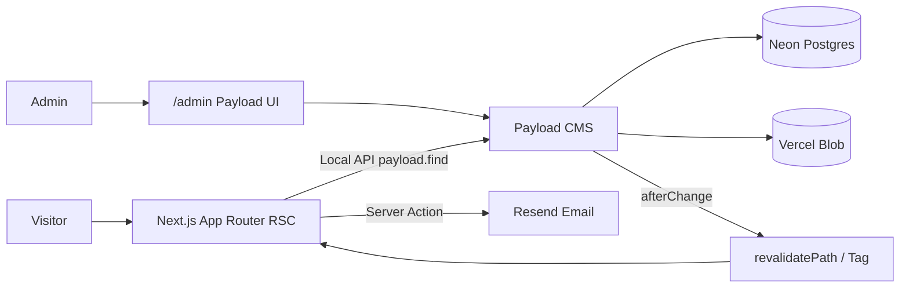
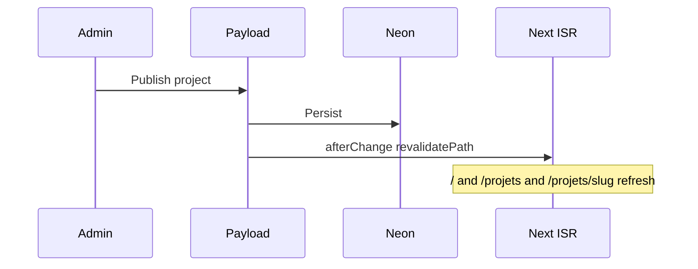

# Modern Portfolio CMS - Plan

## Goal Capsule

- **Objective:** Ship a CMS-driven personal portfolio (Next.js 15 + Payload CMS 3 + Neon + Vercel) where all public content is editable from `/admin` with zero hardcoded copy.
- **Authority:** This plan > origin roadmap (`docs/brainstorms/2026-07-20-modern-portfolio-roadmap.md`) for sequencing; origin roadmap remains the product/scope authority for WHAT.
- **Product Contract preservation:** Product Contract derived from origin sections 00–01, 07–11, 14–19, 21–22, 24–30; blog (20) and evolutions (33) deferred unchanged.
- **Stop when:** MVP checklist in Definition of Done is met (public pages CMS-driven, contact works, SEO basics, deployable on Vercel with Neon + Blob).
- **Out of scope for this run:** Multi-langue, e-commerce, auth visiteurs, blog, mode clair, newsletter.

---

## Product Contract

### Summary

Portfolio personnel dark-first, 100 % piloté par Payload (embarqué dans Next.js), une base Neon, un déploiement Vercel, contenu éditable sans redéploiement via ISR + revalidation à la demande.

### Problem Frame

Aujourd’hui un portfolio “statique” impose de toucher le code pour chaque texte, image ou projet. Le besoin est un backoffice unique (`/admin`) et un front qui ne contient aucun contenu en dur, avec perf/SEO natifs et une stack mono-repo simple à maintenir seul.

### Requirements

| ID | Requirement |
|---|---|
| R1 | Aucun contenu éditorial en dur dans le front ; tout vient de Payload (collections/globals) via Local API. |
| R2 | Pages publiques : `/`, `/projets`, `/projets/[slug]`, `/a-propos`, `/contact` ; `/admin` pour Payload. |
| R3 | Collections : Projects, Skills, Experiences, Media, Users ; globals SiteSettings + SEODefaults. |
| R4 | Formulaire de contact : validation serveur, email Resend, stockage soumission, anti-spam de base. |
| R5 | Médias sur stockage objet (Vercel Blob), `alt` obligatoire, tailles image (thumbnail/card/hero). |
| R6 | Design dark-first glassmorphism ; fonts Syne / DM Sans / Space Grotesk ; bottom tab bar mobile. |
| R7 | SEO : `generateMetadata`, sitemap, robots, OG/Twitter, JSON-LD Person/CreativeWork. |
| R8 | Perf : `next/image`, fonts `next/font`, ISR + `revalidatePath`/`revalidateTag` afterChange. |
| R9 | Sécurité : access control Payload (published public), headers sécurité, secrets en env, rate-limit login/contact. |
| R10 | Déploiement unique Vercel + Neon (pooled URI) + variables documentées ; preview branches Neon recommandées. |
| R11 | Qualité : Lighthouse ≥ 95 cible MVP ; tests critiques formulaire + rendu projets ; TypeScript strict. |

### Actors

- A1. Visiteur anonyme — lit le site, soumet le contact.
- A2. Admin (toi) — authentifié Payload, gère tout le contenu via `/admin`.

### Key Flows

- F1. Parcours portfolio
  - **Trigger:** Visiteur ouvre `/` ou `/projets`.
  - **Actors:** A1
  - **Steps:** Contenu chargé via Local API ; filtres stack côté client sur `/projets` ; détail via slug.
  - **Covered by:** R1, R2, R3
- F2. Édition backoffice → front live
  - **Trigger:** A2 publie/modifie un projet.
  - **Actors:** A2
  - **Steps:** afterChange Payload → revalidation chemins → pages régénérées sans redéploiement.
  - **Covered by:** R1, R8
- F3. Contact
  - **Trigger:** A1 soumet le formulaire.
  - **Actors:** A1, A2 (destinataire email)
  - **Steps:** Zod → Server Action → Resend + FormSubmissions → toast succès/erreur.
  - **Covered by:** R4

### Acceptance Examples

- AE1. Covers F2 / R1. Given un projet `draft`, When un visiteur charge `/projets`, Then le projet n’apparaît pas ; After passage à `published` + revalidation, Then il apparaît.
- AE2. Covers F3 / R4. Given formulaire valide, When submit, Then email envoyé et enregistrement en base ; Given honeypot rempli, Then rejet silencieux/soft.
- AE3. Covers R6. Given viewport under the `lg` breakpoint, When navigation, Then BottomTabBar visible ; Given `lg` and up, Then header desktop, pas de tab bar.

### Success Criteria

- Checklist origin §30 : 100 % CMS-driven, contact OK, Lighthouse ≥ 95 cible, SEO de base, aucun secret commité, déployable prod.

### Scope Boundaries

**In scope (MVP):** origin phases 1–5 (install → design → pages → qualité → mise en prod scaffolding).

**Deferred for later:** Blog (`Posts`, RSS) ; multi-langue ; newsletter ; mode clair ; stats de vues ; CV PDF dynamique ; Turnstile (honeypot suffit en v1 sauf spam réel).

**Outside this product's identity:** E-commerce ; auth visiteurs ; multi-tenant.

### Dependencies

- Compte Neon (ou Marketplace Vercel Neon), projet Vercel, token Blob, clé Resend, domaine optionnel.

### Sources

- Origin: `docs/brainstorms/2026-07-20-modern-portfolio-roadmap.md`
- Payload 3 + Next.js native: https://github.com/payloadcms/payload
- Payload install / Next version pins: https://github.com/payloadcms/payload/blob/main/docs/getting-started/installation.mdx
- Neon + Payload guide: https://neon.com/guides/payload
- Neon pooling: https://neon.com/docs/connect/connection-pooling.md
- Vercel Blob: https://vercel.com/docs/storage/vercel-blob

---

## Planning Contract

### Assumptions

- Repo actuellement vide (`README.md` seulement) : greenfield via `create-payload-app` template **blank** + Postgres, comme l’origin (pas le template `website`).
- Design product identity = dark-first / glassmorphism de l’origin (prioritaire sur préférences design génériques hors brief).
- Routes et copy UI en français (`/a-propos`, `/projets`, etc.).
- Package manager : **pnpm**.
- Stockage médias v1 : **Vercel Blob** (pas R2).
- Form submissions : plugin `@payloadcms/plugin-form-builder` **ou** collection dédiée minimale si le plugin ajoute trop de surface — préférer le plugin si le setup reste simple, sinon collection `FormSubmissions` manuelle.
- 2FA Payload : hors MVP si pas de plugin stable ; mot de passe fort + rate-limit login.
- Credentials cloud (Neon/Vercel/Resend/Blob) fournis par l’humain au moment du deploy ; le plan livre le code + `.env.example` + checklist.

### Key Technical Decisions

| ID | Decision | Rationale |
|---|---|---|
| KTD1 | Payload 3 embarqué dans Next (`app/(payload)`), Local API dans RSC | Un seul déploiement ; zero-latency serveur ; origin §04. |
| KTD2 | `@payloadcms/db-postgres` + Neon pooled (`-pooler`) | Serverless Vercel ; scale-to-zero ; branches preview. |
| KTD3 | Contenu front via `getPayload()` helper, jamais `fetch('/api/...')` interne | Évite le hop HTTP ; origin §04/§23. |
| KTD4 | ISR `revalidate = 3600` + hooks `afterChange` → `revalidatePath`/`revalidateTag` | Édition sans redéploiement ; origin §16/§24. |
| KTD5 | Tailwind v4 + Framer Motion + `prefers-reduced-motion` | Design system origin §09–§12. |
| KTD6 | Server Components par défaut ; `'use client'` seulement pour filtres, form, motion, tab bar | Perf + conventions origin §31. |
| KTD7 | Pin Next.js sur une plage supportée Payload (vérifier docs install au scaffold) | Payload documente des plages Next 15.x précises ; éviter un minor incompatible. |

### High-Level Technical Design





### Output Structure

```text
modern-portfolio/   # repo root after scaffold
├── src/
│   ├── app/
│   │   ├── (frontend)/
│   │   │   ├── layout.tsx
│   │   │   ├── page.tsx
│   │   │   ├── projets/
│   │   │   │   ├── page.tsx
│   │   │   │   └── [slug]/page.tsx
│   │   │   ├── a-propos/page.tsx
│   │   │   └── contact/page.tsx
│   │   └── (payload)/
│   │       ├── admin/[[...segments]]/page.tsx
│   │       └── api/[...slug]/route.ts
│   ├── collections/
│   │   ├── Projects.ts
│   │   ├── Skills.ts
│   │   ├── Experiences.ts
│   │   ├── Media.ts
│   │   ├── Users.ts
│   │   └── FormSubmissions.ts   # or via form-builder plugin
│   ├── globals/
│   │   ├── SiteSettings.ts
│   │   └── SEODefaults.ts
│   ├── components/
│   │   ├── ui/
│   │   ├── sections/
│   │   └── layout/
│   ├── lib/
│   │   ├── payload.ts
│   │   ├── utils.ts
│   │   └── revalidate.ts
│   ├── payload.config.ts
│   └── payload-types.ts
├── .env.example
├── next.config.ts
└── package.json
```

### Alternative Approaches Considered

| Approach | Why not |
|---|---|
| Sanity / Strapi séparés | Origin : vendor lock ou service backend à part — friction Vercel. |
| Template Payload `website` | Accélère, mais l’origin impose blank + collections portfolio custom ; plus de code à démêler. |
| MongoDB | Origin Postgres/Neon pour branching preview et stack unifiée. |

### Risks & Dependencies

| Risk | Mitigation |
|---|---|
| Next.js minor incompatible Payload | KTD7 : pin version supportée dès le scaffold. |
| Cold start Neon + serverless | Pooled connection ; éventuellement Neon serverless driver si timeouts. |
| Blob + imageSizes Payload sur Vercel | Valider plugin `@payloadcms/storage-vercel-blob` tôt (U3). |
| Spam contact | Honeypot + rate-limit ; Turnstile en follow-up. |
| Secrets manquants en CI/agent | `.env.example` + smoke local avec Neon branch ; deploy gate documentée. |

### Phased Delivery

1. **Fondations** — U1–U3 (scaffold, modèle, médias/auth)
2. **Shell UI** — U4
3. **Pages CMS** — U5
4. **Contact + revalidation + sécurité** — U6
5. **SEO/perf + qualité/deploy** — U7–U8

---

## Implementation Units

### Unit Index

| U-ID | Title | Key files | Depends on |
|---|---|---|---|
| U1 | Scaffold Payload + Next + Tailwind | `package.json`, `src/app/**`, `next.config.ts` | — |
| U2 | Collections, globals, access, types | `src/collections/*`, `src/globals/*`, `payload.config.ts` | U1 |
| U3 | Media Blob + Users hardening | `Media.ts`, storage plugin, middleware | U2 |
| U4 | Design system + layout shell | `components/ui/*`, `layout/*` | U1 |
| U5 | Public pages + Local API | `(frontend)/**/page.tsx`, `lib/payload.ts` | U2, U4 |
| U6 | Contact + revalidation + security headers | contact action, hooks, `next.config.ts` | U2, U5 |
| U7 | SEO metadata + sitemap + JSON-LD | `generateMetadata`, `sitemap.ts`, `robots.ts` | U5 |
| U8 | Tests critiques + deploy scaffolding | Vitest/Playwright, `.env.example`, README | U5, U6, U7 |

### U1. Scaffold Payload + Next + Tailwind

- **Goal:** Projet exécutable localement avec `/admin` et Tailwind v4.
- **Requirements:** R2 (structure routes), R10 (base env)
- **Dependencies:** —
- **Files:**
  - create/modify: `package.json`, `pnpm-lock.yaml`, `next.config.ts`, `src/app/(payload)/**`, `src/app/(frontend)/layout.tsx`, `src/payload.config.ts`, `.env.example`, `.gitignore`
  - test: smoke manuel `/admin` (pas de suite encore)
- **Approach:** `pnpx create-payload-app@latest` blank + Postgres ; aligner arborescence origin §05 ; ajouter `framer-motion`, `clsx`, `tailwind-merge`, `lucide-react`, Tailwind v4 ; vérifier pin Next (KTD7) ; `DATABASE_URI` + `PAYLOAD_SECRET` dans `.env.example`.
- **Execution note:** Prefer install/runtime smoke (`pnpm dev`, `/admin` loads) over unit tests.
- **Patterns to follow:** Official create-payload-app blank layout ; origin §03.
- **Test scenarios:**
  - Happy path: `pnpm install && pnpm dev` → `/admin` répond (redirect login ou UI).
  - Edge: build `pnpm build` réussit sans secrets réels si possible, ou documente le besoin de `PAYLOAD_SECRET`.
- **Verification:** Dev server up ; TypeScript compile ; structure dossiers origin présente.

### U2. Collections, globals, access, types

- **Goal:** Modèle de contenu portfolio complet avec access control et types générés.
- **Requirements:** R1, R3, R9
- **Dependencies:** U1
- **Files:**
  - create: `src/collections/Projects.ts`, `Skills.ts`, `Experiences.ts`, `Media.ts` (base), `Users.ts`, `src/globals/SiteSettings.ts`, `SEODefaults.ts`
  - modify: `src/payload.config.ts`
  - generate: `src/payload-types.ts`
  - test: `src/collections/__tests__/slugify.test.ts` (ou util partagé)
- **Approach:** Champs Projects per origin §07 (slug hook beforeChange) ; Skills categories ; Experiences dates ; globals SiteSettings/SEODefaults ; `read` public seulement si `status === 'published'` (Projects) ; write authenticated ; `payload generate:types`.
- **Patterns to follow:** Payload CollectionConfig + access functions ; origin prompts §07/§17.
- **Test scenarios:**
  - Happy path: slug auto depuis title si vide.
  - Edge: title avec accents/espaces → slug URL-safe unique.
  - Access: unquery published-only pour rôle anonyme (unit sur access fn si extractible).
- **Verification:** Admin liste Collections/Globals ; types importables ; push schema Neon/dev OK.

### U3. Media Blob + Users hardening

- **Goal:** Uploads durables + admin sans inscription publique + rate-limit login.
- **Requirements:** R5, R9
- **Dependencies:** U2
- **Files:**
  - modify: `src/collections/Media.ts`, `src/payload.config.ts`, `src/middleware.ts` (ou équivalent)
  - env: `BLOB_READ_WRITE_TOKEN` in `.env.example`
  - test: `src/collections/__tests__/mediaAlt.required.test.ts` (config assertion) si pertinent
- **Approach:** `@payloadcms/storage-vercel-blob` ; `imageSizes` thumbnail 400 / card 800 / hero 1600 ; `alt` required ; Users : login only ; middleware rate-limit `/api/users/login`.
- **Execution note:** Smoke upload in admin once Blob token available; otherwise mock/skip in CI with documented gate.
- **Test scenarios:**
  - Happy path: config Media exposes required `alt` + three sizes.
  - Error: login burst exceeds rate-limit → 429.
- **Verification:** Upload admin → URL Blob ; login throttled.

### U4. Design system + layout shell

- **Goal:** Fondations UI + navigation responsive (header desktop / bottom tabs mobile).
- **Requirements:** R6
- **Dependencies:** U1
- **Files:**
  - create: `src/components/ui/{GlassCard,Button,Badge,SectionTitle,Container}.tsx`, `src/components/layout/{Header,Footer,BottomTabBar}.tsx`, `src/components/motion/FadeInWhenVisible.tsx`, `src/lib/utils.ts`
  - modify: `(frontend)/layout.tsx` (fonts next/font)
  - test: `src/components/layout/BottomTabBar.test.tsx`
- **Approach:** Tokens CSS dark (`#0a0a0f`–`#111118`), glass (`backdrop-blur`, `bg-white/5`, `border-white/10`) ; Syne/DM Sans/Space Grotesk via `next/font` ; BottomTabBar `lg:hidden` ; FadeInWhenVisible + `useReducedMotion`.
- **Patterns to follow:** origin §09–§13 ; un composant = un fichier.
- **Test scenarios:**
  - Happy path: BottomTabBar rend 4 liens Accueil/Projets/À propos/Contact.
  - Edge: `prefers-reduced-motion` → FadeInWhenVisible n’applique pas de transform animé.
  - Covers AE3: classes visibility `lg:hidden` / `hidden lg:…` présentes.
- **Verification:** Layout shell sans données CMS ; mobile + desktop OK visuellement.

### U5. Public pages + Local API

- **Goal:** Toutes les pages publiques branchées Payload, 0 contenu éditorial hardcodé.
- **Requirements:** R1, R2, R3
- **Dependencies:** U2, U4
- **Files:**
  - create: `src/lib/payload.ts`, `src/components/sections/{Hero,ProjectGrid,ProjectCard,ProjectFilters,SkillBadgeList,ExperienceTimeline,RichTextRenderer}.tsx`
  - create: `(frontend)/page.tsx`, `projets/page.tsx`, `projets/[slug]/page.tsx`, `a-propos/page.tsx`, `contact/page.tsx` (shell)
  - test: `src/components/sections/ProjectCard.test.tsx`, optional integration with mocked payload
- **Approach:** `getPayload()` ; home = SiteSettings + featured Projects ; `/projets` published sort `order` + client filters ; detail `generateStaticParams` ; about = settings + experiences + skills ; RichText via `@payloadcms/richtext-lexical/react`.
- **Execution note:** Seed minimal via admin or seed script so pages aren’t empty during smoke.
- **Patterns to follow:** origin §14/§21/§31 Local API.
- **Test scenarios:**
  - Happy path: ProjectCard affiche title, excerpt, stack badges.
  - Edge: liste vide → empty state sans crash.
  - Integration: page projets ne liste que `status=published` (mock Local API).
  - Covers AE1: draft exclu de la query where.
- **Verification:** Chaque route rend avec seed CMS ; aucune string marketing hardcodée hors UI chrome (labels nav OK).

### U6. Contact + revalidation + security headers

- **Goal:** Contact production-ready + publication immédiate + headers sécurité.
- **Requirements:** R4, R8, R9
- **Dependencies:** U2, U5
- **Files:**
  - create: `src/components/sections/ContactForm.tsx`, `src/app/(frontend)/contact/actions.ts`, `src/lib/revalidate.ts`, form schema zod
  - modify: Projects/Skills/Experiences/globals hooks `afterChange`, `next.config.ts` headers, rate-limit contact
  - test: `src/app/(frontend)/contact/actions.test.ts`, `ContactForm.test.tsx`
- **Approach:** RHF + zod + Server Action → Resend + persist submission ; honeypot ; sonner toasts ; afterChange revalidate `/`, `/projets`, `/projets/[slug]`, `/a-propos` ; CSP/X-Frame/Referrer-Policy.
- **Test scenarios:**
  - Happy path: payload valide → success + Resend appelé (mock) + persist.
  - Error: email invalide → erreur zod, pas d’envoi.
  - Edge: honeypot rempli → pas d’email.
  - Covers AE2.
  - Integration: afterChange helper appelle revalidatePath avec les bons chemins.
- **Verification:** Submit local (Resend test) ; publish projet → front rafraîchi ; headers présents sur réponse.

### U7. SEO metadata + sitemap + JSON-LD

- **Goal:** SEO technique complet sur toutes les pages publiques.
- **Requirements:** R7
- **Dependencies:** U5
- **Files:**
  - modify: chaque `page.tsx` avec `generateMetadata`
  - create: `src/app/sitemap.ts`, `src/app/robots.ts`, JSON-LD helpers
  - test: `src/app/sitemap.test.ts` or unit on URL builders
- **Approach:** Metadata depuis Payload (title/excerpt/cover) ; fallback SEODefaults ; sitemap projets published + routes statiques ; JSON-LD Person (about) + CreativeWork (projet).
- **Test scenarios:**
  - Happy path: sitemap contient `/projets/{slug}` published seulement.
  - Edge: projet sans cover → OG fallback SEODefaults image.
- **Verification:** View-source meta/OG ; `/sitemap.xml` et `/robots.txt` OK.

### U8. Tests critiques + deploy scaffolding

- **Goal:** Filet de sécurité + chemin clair vers Vercel/Neon prod.
- **Requirements:** R10, R11
- **Dependencies:** U5, U6, U7
- **Files:**
  - create: Vitest config, Playwright smoke (`e2e/smoke.spec.ts`), `README.md` (install/env/deploy), optional `scripts/seed.ts`
  - modify: `package.json` scripts `test`, `test:e2e`, `build`
- **Approach:** Prioriser ContactForm + ProjectCard + 1 parcours E2E nav+projet ; documenter Marketplace Neon, Blob, Resend, `PAYLOAD_SECRET` ; checklist origin §26 ; Vercel Analytics optional note.
- **Execution note:** Smoke-first for deploy docs; E2E may skip in CI without secrets with clear skip reason.
- **Test scenarios:**
  - E2E: Accueil → Projets → détail visible.
  - E2E: Contact submit happy path (mock Resend).
  - Unit suite verte en CI sans services externes.
- **Verification:** `pnpm test` vert ; README permet à un tiers de déployer ; `pnpm build` documenté comme gate pré-push.

---

## Verification Contract

| Gate | Command / check | Pass criteria |
|---|---|---|
| Typecheck | `pnpm exec tsc --noEmit` (ou script repo) | 0 errors |
| Unit | `pnpm test` | U2/U4/U5/U6 scenarios green |
| Build | `pnpm build` | Success with required env |
| Smoke admin | `pnpm dev` → `/admin` | Login UI loads |
| Smoke CMS | Seed + visit `/`, `/projets`, `/a-propos`, `/contact` | No hardcoded editorial ; data from CMS |
| Contact | Submit form with Resend test key | Email + DB row |
| SEO | `/sitemap.xml`, page meta | Published slugs listed ; OG present |
| A11y/perf target | Lighthouse mobile/desktop on home + project | ≥ 95 as stretch gate before calling MVP done |
| Secrets | `git grep` / review | No `.env.local` or secrets committed |

---

## Definition of Done

**Global**

- [ ] R1–R11 satisfaits pour le MVP (blog exclu).
- [ ] Origin checklist §30 cochable sauf domaine custom si non fourni (domaine = soft gate).
- [ ] Code mort d’essais abandonnés retiré.
- [ ] Types Payload régénérés et commités.
- [ ] README + `.env.example` à jour.

**Per unit:** chaque U1–U8 Verification + Test scenarios passent ou ont une exemption documentée (ex. Blob token absent en CI).

---

## Appendix

### Origin mapping

| Origin section | Plan coverage |
|---|---|
| 03–08 Fondations | U1–U3 |
| 09–13 Design/UI | U4 |
| 14, 18, 19, 21 Pages/contenu | U5–U6 |
| 15–17 Qualité | U6–U7 |
| 25–28 Deploy/tests | U8 |
| 20 Blog / 33 Evolutions | Deferred |

### Cursor conventions (carry forward)

Server Components by default ; Local API only for internal data ; PascalCase components ; regenerate types after collection changes ; strict TS before unit complete (origin §31).
